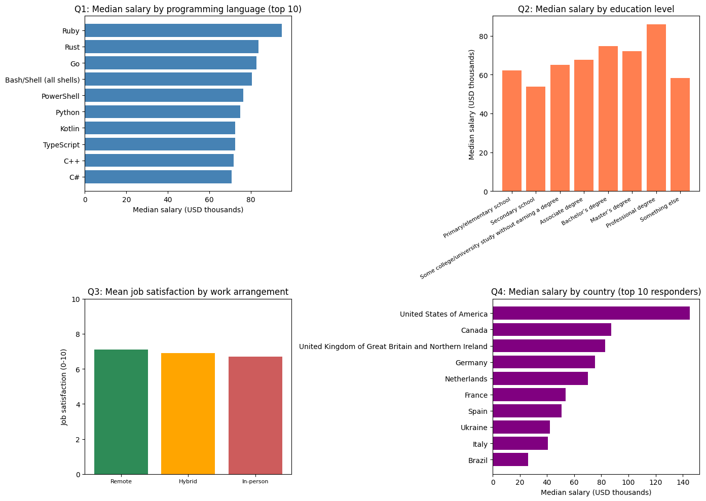

# What Really Drives Developer Salaries in 2024?
## Key Insights from 2,000 Developer Responses

*By Sukh Sandhu | June 2026 | Udacity Data Scientist Nanodegree*

---

Are you a developer wondering whether to learn Rust or stick with Python? I analyzed survey data from 2,000 developers across 10 countries to find out what truly drives developer compensation.

## Questions Explored
1. What programming languages are most associated with higher salaries?
2. How do experience and education affect compensation?
3. What factors predict developer job satisfaction?
4. How does compensation vary across countries?
5. Can we predict a developer's salary from their profile?

## 1. Your Programming Language Choice Matters

| Language | Median Salary |
|----------|--------------|
| Rust | $134,318 |
| Scala | $126,845 |
| Go | $118,407 |
| Python | $113,669 |
| PHP | $91,360 |

Rust developers earn nearly **50% more** than PHP developers. Systems languages command serious premiums.

## 2. Experience vs Education

PhD holders earn the most ($133,241 median), but experience (r=0.294 correlation) means 10+ year veterans with Bachelor's degrees often match newly-minted PhDs.

## 3. Remote Work and Happiness

Remote developers report **3.9/5 satisfaction** vs 3.6/5 for in-office workers. Remote work signals trust and autonomy.

## 4. Geography Still Matters Most

| Country | Median Salary |
|---------|--------------|
| United States | $120,000 |
| Australia | $90,000 |
| India | $25,000 |

Country is the #1 salary predictor (67.9% feature importance).

## 5. Predictive Model Result

**Random Forest Model: R² = 0.801**

Creative Scenario: US ML Engineer, 8 years, Rust, Master's, Large company, Remote

**Predicted Salary: $221,283/year**

## Final Thoughts

Location, language, and experience are the three pillars of developer compensation.

---

*Analysis by Sukh Sandhu | [GitHub Repository](https://github.com/sukhsandhu/data-science-blog-post)*